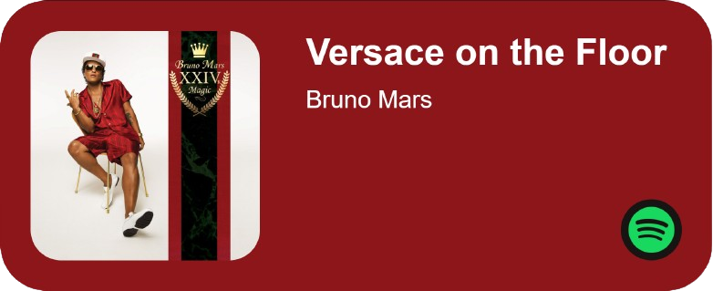

<!-- Title and Description -->
# Basic Spotify Web Application
**A Basic Spotify Web Application.**
<!-- How to Setup -->
## How to Setup:
#### 1. Go to https://developer.spotify.com/dashboard
#### 2. Create an app
- Name and Description can be anything
- Ignore the website text box
- Set the Redirect URI to `http://localhost:3000/callback`
- Checkmark the Web API
- Once created, head to `Settings` in the top right
- Copy the ClientID, Client Secret, and the Redirect URI to the `TEMPLATE.env` file
- Rename `TEMPLATE.env` to just `.env`
#### 3. Run the `start.bat` file
#### 4. Go to `localhost:3005` in any browser
#### 5. Sign in to Spotify
#### 7. Done.
<!-- How to import to OBS -->
## How to import to OBS:
#### 1. Go through the setup above.
#### 2. In OBS, import a browser source.
- URL is `localhost:3005/app`.
- Width can be anything, **but at least 525px**, and the height is `300`, *no more*, *no less*.
> [!NOTE]
> You may have to refresh the source for it to update.
#### 3. Done
## Screenshots

